# TUGAS PRAKTIKUM 5 - PERTEMUAN 9

Nama        : Bangkit Akbar Anggara 
NIM        : 312010148 
Kelas        : TI.20.B.1 

# TUGAS

Pada pertemuan ke-9 saya diberi tugas oleh dosen saya untuk membuat program sederhana seperti gambar dibawah ini: 
  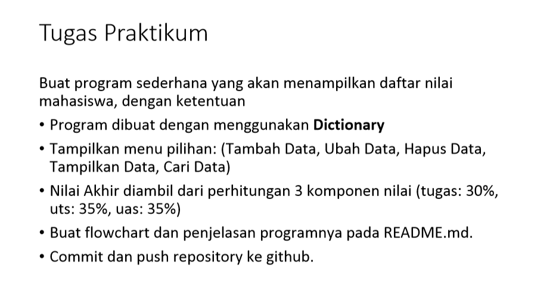

Ketika kita belum memasukkan data siswa maka akan muncul seperti gambar di bawah ini:
  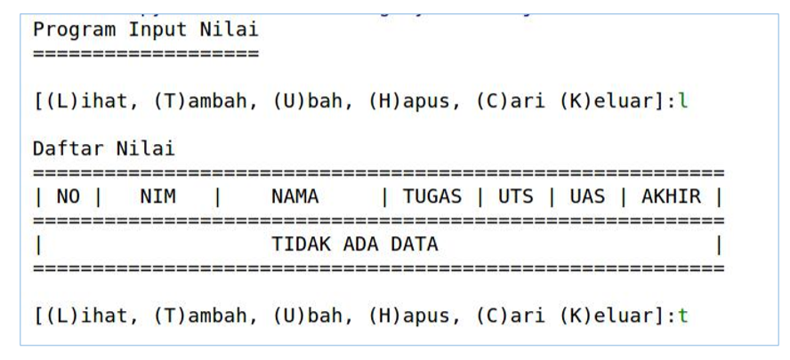
  
Lalu setelah memasukkan data siswa maka outputnya harus seperti ini:
  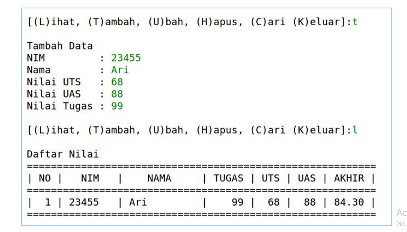
  
Oke mari kita mulai mengerjakan tugasnya, untuk source code/syntax yang saya gunakan silahkan kalian lihat disini [Click Here](tugas_praktikum_5.py)

Oke setelah kalian lihat saya akan menjelaskan fungsi - fungsinya :

1. Syntax untuk membuat pilihan menambah data, melihat data, menhapus data, mencari data atau keluar dari program 
Keterangan:
    - Pertama kita buat dictionary kosong dulu yap kita tulis data:{} dictionary hampir sama dengan list hanya saja bedanya list menggunakan tanda kurung siku[], sementara dictionary menggunakan tanda kurung kurawal {} 
    - Setelah membuat data dictionary kosong kita akan menggunakan perulangan while True dan membuat sebuah inputan pilihan apakah kita ingin menambah data, melihat data, menhapus data, mencari data atau keluar dari program 
    - Lalu kita buat x =  input untuk memasukkan pilihan tadi 
      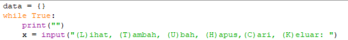
 

2. Syntax untuk keluar dari program 
Keterangan :
    - Kita akan menggunakan if untuk mengeksekusi code/syntax jika kondisi bernilai benar/True 
    - Lalu gunanya x.lower adalah lower di gunakan untuk mengubah atau mengkonversi huruf - huruf yang ada pada kalimat supaya menjadi berhuruf kecil, sementara x adalah data pilihan yang kita pilih sebelumnya 
    - Lalu kita tulis kata - kata untuk menunjukan bahwa anda sudah benar - benar keluar 
    - Lalu kita gunakan fungsi break untuk keluar dari program 
      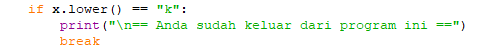

3. Syntax untuk melihat data dictionary/data siswa 
Keterangan :
    - Disini kita menggunakan elif untuk menyeleksi data dan elif merupakan lanjutan/percabangan dari logika if
    - Kita gunakan fungsi if untuk mencetak/print data siswa yang sudah di inputkan makanya kita menggunakan data.items() 
    - Lalu kita gunakan print untuk membuat table agar terlihat lebih rapih 
    - Lalu gunanya for untuk melakukakan perulangan nomor dan juga data siswa yang kita inputkan nanti 
    - Lalu kita buat lagi di bawahnya else agar ketika kita belom menginputkan data siswa akan muncul tidak ada data / tidak ada daftar nilai
      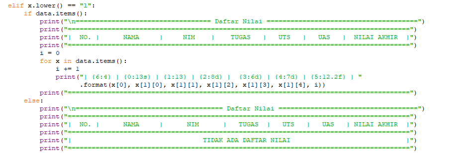

4. Syntax untuk menambah data siswa 
Keterangan:
    - Disini kita akan menggunakan inputan data seperti biasa Nama, NIM, Hasil Tugas, Hasil UTS, Hasil UAS, dan juga Hasil Akhir 
    - Untuk nama kita cukup ketikan input di python 3 raw_input dengan input sama saja karena sudah di satukan dan kita menggunakan integer untuk bagian NIM dan juga Hasil Tugas, UTS, UAS, dan Hasil Akhir 
    - Lalu kita akan menghitung Hasil Akhir dengan cara menambahkan semua Hasil Tugas, UTS, dan UAS tentu saja kita menggunakan 30/100 dan 35/100 karena di dalam tugasnya seperti itu 
      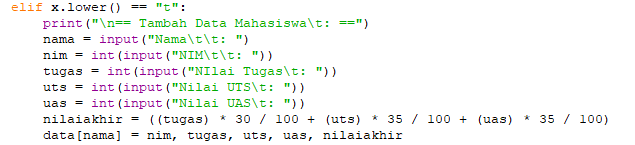
      
      
5. Syntax untuk mengubah data siswa 
Keterangan:
    - Disini kita menggunakan elif untuk menyeleksi data dan elif merupakan lanjutan/percabangan dari logika if
    - Kita gunakan input untuk memasukkan nama siswa yang ingin data nilainya kita ubah 
    - Disini kita akan mengubah fungsi if lagi untuk mengeksekusi syntax di data.keys 
    - Lalu kita masukkan NIM dan juga tugas yang sudah diperbarui/diperbaiki 
    - Lalu else di gunakan jika kita belom menginputkan data mahasiswa sama sekali sehingga akan muncul tampilan data(nama siswa yang ingin di ubah nilainya)tidak ada 
      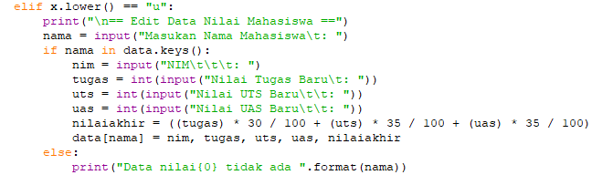
      
      
6. Syntax untuk menghapus data siswa 
Keterangan:
    - Disini kita menggunakan elif untuk menyeleksi data dan elif merupakan lanjutan/percabangan dari logika if
    - Kita gunakan input untuk memasukkan nama siswa yang ingin datanya kita hapus 
    - Lalu kita gunakan if lagi dan data.keys 
    - Lalu del data[nama] untuk menghapus data siswa tersebut 
    - Lalu kita gunakan else jika kita belom menginputkan data sama sekali sehingga muncul tampilan data(nama siswa yang ingin di hapus)tidak ada 
      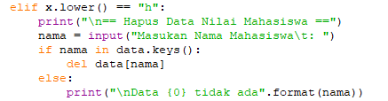
      
     
7. Syntax untuk mencari data siswa 
Keterangan:
    - Disini kita menggunakan elif untuk menyeleksi data dan elif merupakan lanjutan/percabangan dari logika if
    - Kita gunakan input untuk mencari data siswa dengan namanya 
    - Lalu kita gunakan if lagi untuk mengeksekusi data siswa 
    - Lalu print menggunakan table agar terlihat lebih rapih 
    - Lalu else di gunakan jika kita belom menginputkan data sehingga muncul tampilan data dari(nama siswa yang di cari)tidak ada 
      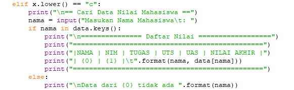
      
      
8. Syntax jika kita tidak memilih salah satu pada pilihan menu 
Keterangan:
    - Disini kita menggunakan else untuk mengeksekusi code/syntax jika bernilai False 
    - Kita disuruh memilih ingin menambahkan data, melihat data, mengubah data, mencari data, atau keluar dari program 
    - Jadi ketika kita tidak memilih pilihan apapun maka akan muncul tulisan pilih menu yang tersedia 
      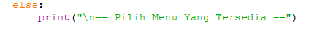
      

Oke itu adalah penjelasan dari masing -  masing syntax dan fungsinya, maka jika kita jalankan atau run syntaxnya makan akan muncul seperti ini:

1. Pilihan untuk menambahkan, mengubah, mencari, melihat, menghapus, dan keluar 
    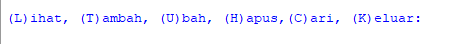
    
 
2. Keluar dari program 
    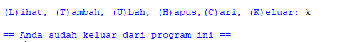

3. Melihat dictionary jika kita belom menginputkan data siswa 
    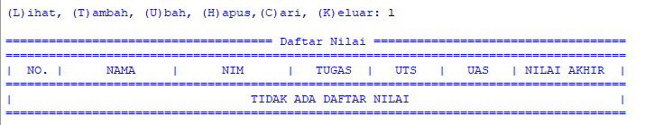
 

4. Menambah data siswa dan melihat data siswa tersebut
    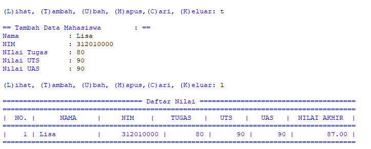
    
    
5. Mengubah data siswa dan melihat hasil perubahan data nilai siswa tersebut 
    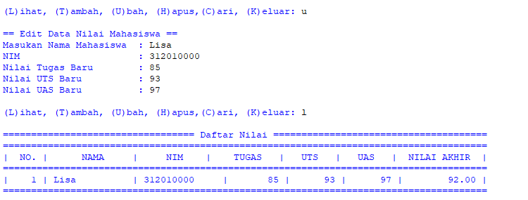
    
 
6. Menghapus data siswa dan melihat data siswa apakah sudah terhapus atau belum 
    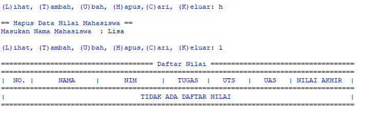
    
  
7. Mencari data siswa dengan namanya 
    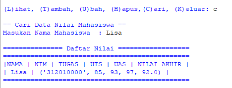
    
   
8. Jika kita tidak memilih pilihan tambah, hapus, cari, ubah, atau keluar
    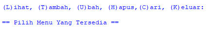
    
    
Oke dengan begini selesai sudah tugas pada pertemuan ke-9 sampai jumpa

by:
# == Bangkit Akbar Anggara ==
# == 312010148 ==
# == TI.20.B.1 ==
